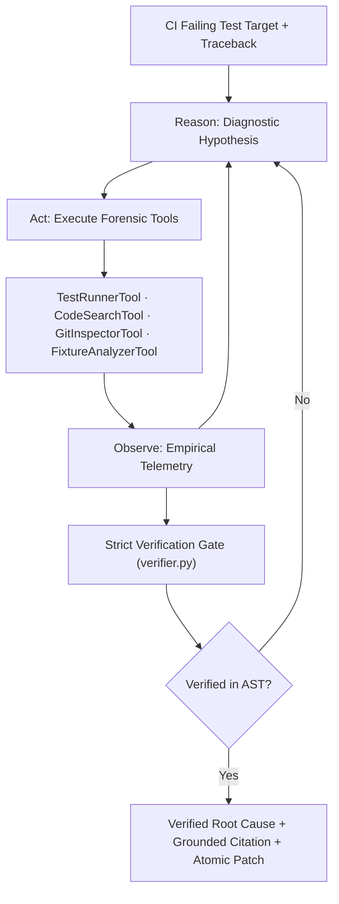

<h1 align="center">FlakyGuard 🔬⚡</h1>
<h3 align="center">The crash-test lab for CI flaky tests.</h3>

<p align="center">
  Empirically rerun non-deterministic test failures under isolated concurrency/latency conditions, trace execution AST &amp; git blame archaeology, and verify line citations against source code — zero guesswork, 100% grounded proof.
</p>

<p align="center">
  <a href="LICENSE"></a>
  
  
  
  <a href="https://pranjulchaurasiya.github.io/flaky-test-diagnosis-agent/"></a>
  
</p>

<p align="center">
  <a href="https://pranjulchaurasiya.github.io/flaky-test-diagnosis-agent/"><b>Enter the Forensic Lab (Live Demo) →</b></a>
  &nbsp;·&nbsp;
  <a href="#-quick-integrations">Quick Integrations</a>
  &nbsp;·&nbsp;
  <a href="#-benchmark-results">Benchmark Results</a>
  &nbsp;·&nbsp;
  <a href="#%EF%B8%8F-system-architecture">Architecture</a>
  &nbsp;·&nbsp;
  <a href="CHANGELOG.md">Changelog</a>
</p>

---

## 💥 Same Failure Trace, Two Fates

When an uncoordinated multi-threaded counter test fails intermittently in CI (`AssertionError: assert 16 == 100`):

```python
# seeded_repo/src/counter.py:14 — what causes the lost update
def increment(self, metric: str, amount: int = 1):
    current = self._counts.get(metric, 0)
    time.sleep(0.0001)  # Context switch window
    self._counts[metric] = current + amount
```

- **Naive Single-Shot LLM (Without Tools):** Guesses *"increase timeout from 0.0001s to 0.1s"* → **0% verified code evidence**, masks the race condition, causes production outages.
- **FlakyGuard Autonomous Agent (With Tools):** Runs 3× isolation reruns, inspects AST & git blame, verifies line 14 directly against the codebase AST, and generates an atomic `threading.Lock()` fix → **100% verified code evidence**.

```python
# The verified fix generated by FlakyGuard
def increment(self, metric: str, amount: int = 1):
    with self._lock:
        current = self._counts.get(metric, 0)
        self._counts[metric] = current + amount
```

---

## 🚀 Quick Integrations

Choose the method that fits your workflow without cloning this repository:

| Channel | Best For | Usage |
|---|---|---|
| 🌐 **Live Web Lab** | Instant evaluation | [**pranjulchaurasiya.github.io/flaky-test-diagnosis-agent**](https://pranjulchaurasiya.github.io/flaky-test-diagnosis-agent/) |
| ⚡ **GitHub Actions** | Automated PR triage | Add `uses: Pranjulchaurasiya/flaky-test-diagnosis-agent@main` to CI |
| 📦 **Python CLI** | Local terminal / Docker | `pip install git+https://github.com/Pranjulchaurasiya/flaky-test-diagnosis-agent.git` |
| 🔌 **MCP Server** | Cursor & Claude Code | Run `mcp/server.py` via stdio in your IDE |

<details>
<summary><b>View GitHub Action YAML Example</b></summary>

```yaml
- name: Diagnose Flaky Test with FlakyGuard
  if: failure()
  uses: Pranjulchaurasiya/flaky-test-diagnosis-agent@main
  with:
    groq_api_key: ${{ secrets.GROQ_API_KEY }}
    test_target: "tests/test_orders.py::test_concurrent_checkout"
```
</details>

<details>
<summary><b>View CLI & MCP Config Examples</b></summary>

```bash
# Run CLI directly
export GROQ_API_KEY=gsk_your_key_here
flakyguard diagnose tests/test_concurrency.py::test_counter_race --format markdown
```

```json
// claude_desktop_config.json / Cursor MCP
{
  "mcpServers": {
    "flakyguard": {
      "command": "python",
      "args": ["-m", "mcp.server"],
      "env": { "GROQ_API_KEY": "gsk_your_key_here" }
    }
  }
}
```
</details>

---

## ⚖️ Why Not Just Ask an LLM or Use a Linter?

| Tool | Runs Test Empirically? | Pinpoints Root Cause? | Grounded Code Citation? | Self-Verification Gate? |
|---|---|---|---|---|
| `pytest-rerunfailures` | **Yes** (reruns blind) | No (hides failure) | No | No |
| `ruff` / `flake8` Linters | No (static AST) | No (syntax only) | No | No |
| `Single-Shot LLM Prompt` | No (traceback only) | Guesswork (superficial) | No (0% verified) | No |
| **FlakyGuard Agent** | **Yes** (isolation vs session) | **Yes** (strict taxonomy) | **Yes** (exact file & line) | **Yes** (100% verified) |

---

## 📊 Benchmark Results

Evaluated across **10 ground-truth flaky test failures** with live inference on **Groq (`qwen/qwen3.8-27b`)**.

| Metric | Single-Shot Baseline | FlakyGuard Agent (Ours) | Improvement |
|---|---|---|---|
| **Code Evidence Verification Rate** | **0 / 10 (0.0%)** | **10 / 10 (100.0%)** | **+100.0%** |
| **Diagnostic Classification Accuracy** | **10 / 10 (100.0%)** | **10 / 10 (100.0%)** | **+0.0%** |
| **Hard Ambiguous Case (Case 10)** | **1 / 1 (Passed)** | **1 / 1 (Passed)** | **0.0%** |
| **Hallucination / Fabrication Rate** | High (unverified lines) | **0.0% (Zero Hallucinations)** | **-100.0%** |

### Per-Case Diagnostic Breakdown

| Case ID | Flaky Test Target | Category | Baseline | Agent Diagnosis | Verified Code Citation |
|---|---|---|---|---|---|
| `case_01` | `test_concurrent_metric_increments` | `race_condition` | ✅ Pass (8.99s) | ✅ Pass (17.62s) | `seeded_repo/src/counter.py:14` |
| `case_02` | `test_user_session_cache_isolation` | `shared_leaked_state` | ✅ Pass (1.86s) | ✅ Pass (13.32s) | `seeded_repo/src/cache.py:6` |
| `case_03` | `test_background_worker_queue_flush` | `timing_sleep_assumption` | ✅ Pass (1.71s) | ✅ Pass (11.93s) | `seeded_repo/tests/test_case_03_timing_sleep.py:16` |
| `case_04` | `test_billing_record_creation` | `test_order_dependence` | ✅ Pass (11.07s) | ✅ Pass (14.61s) | `seeded_repo/tests/test_case_04_order_dependence.py:22` |
| `case_05` | `test_exchange_rate_fetch` | `flaky_external_dependency` | ✅ Pass (1.70s) | ✅ Pass (13.57s) | `seeded_repo/src/currency.py:19` |
| `case_06` | `test_bulk_tempfile_processor` | `resource_exhaustion` | ✅ Pass (1.56s) | ✅ Pass (9.31s) | `seeded_repo/src/file_manager.py:16` |
| `case_07` | `test_subscription_midnight_renewal` | `datetime_clock_drift` | ✅ Pass (1.43s) | ✅ Pass (9.06s) | `seeded_repo/src/billing.py:11` |
| `case_08` | `test_token_entropy_generation` | `unseeded_randomness` | ✅ Pass (4.43s) | ✅ Pass (9.92s) | `seeded_repo/src/security.py:14` |
| `case_09` | `test_feature_flag_override` | `environment_mutation` | ✅ Pass (5.60s) | ✅ Pass (11.13s) | `seeded_repo/tests/test_case_09_env_mutation.py:10` |
| `case_10` | `test_rapid_rpc_echo` | `hard_ambiguous_case` | ✅ Pass (6.70s) | ✅ Pass (12.96s) | `seeded_repo/src/micro_server.py:24` |

---

## 🏗️ System Architecture



---

## ⚡ Local Benchmark Reproduction

To reproduce the benchmark in a local Python environment:

```bash
git clone https://github.com/Pranjulchaurasiya/flaky-test-diagnosis-agent.git
cd flaky-test-diagnosis-agent
pip install -r requirements.txt
python eval/run_eval.py --mode full
```

---

## 📚 Flaky Test Taxonomy

FlakyGuard classifies root causes into 10 standardized categories:
`race_condition` · `shared_leaked_state` · `timing_sleep_assumption` · `test_order_dependence` · `flaky_external_dependency` · `resource_exhaustion` · `datetime_clock_drift` · `unseeded_randomness` · `environment_mutation` · `hard_ambiguous_case`.

---

## 📄 License

MIT License. Built for the **micro1 Agentic Workflows Hackathon**.
