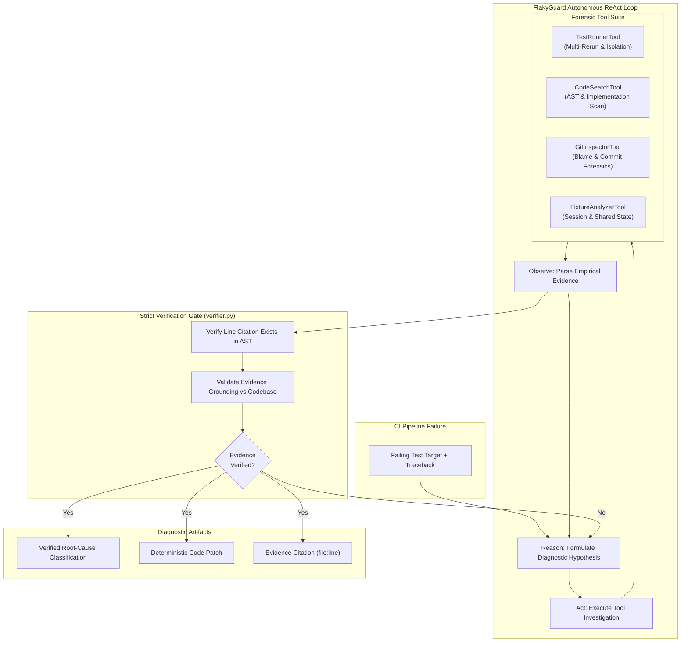

<h1 align="center">FlakyGuard 🔬⚡</h1>
<h3 align="center">The crash-test lab for CI flaky tests.</h3>

<p align="center">
  Empirically rerun non-deterministic test failures under isolated concurrency/latency conditions, trace execution AST &amp; git blame archaeology, and verify line citations against source code — zero guesswork, 100% grounded proof.
</p>

<p align="center">
  <a href="LICENSE"></a>
  
  
  
  <a href="https://pranjulchaurasiya.github.io/flaky-test-diagnosis-agent/"></a>
  
</p>

<p align="center">
  <a href="https://pranjulchaurasiya.github.io/flaky-test-diagnosis-agent/"><b>Enter the Forensic Lab (Live Demo) →</b></a>
  &nbsp;·&nbsp;
  <a href="#quickstart">Quickstart</a>
  &nbsp;·&nbsp;
  <a href="#benchmark-results-evalrun_evalpy">Benchmark Results</a>
  &nbsp;·&nbsp;
  <a href="#architecture">Architecture</a>
  &nbsp;·&nbsp;
  <a href="CHANGELOG.md">Changelog</a>
</p>

---

## 💥 Same Failure Trace, Two Fates

When an uncoordinated multi-threaded counter test fails intermittently in CI with lost increments (`AssertionError: assert 16 == 100`), a single-shot LLM and an autonomous empirical agent produce two radically different outcomes:

```python
# seeded_repo/src/counter.py:14 — what causes the lost update
def increment(self, metric: str, amount: int = 1):
    current = self._counts.get(metric, 0)
    time.sleep(0.0001)  # Context switch window
    self._counts[metric] = current + amount
```

### 1. The Naive LLM Guess (Without Tools)
A single prompt LLM reads the test assertion error, guesses that sleep timings are too tight, and tells you:
> *"Increase the timeout or sleep from 0.0001 to 0.1 seconds."*

**Outcome:** Zero source code verification (0/10), masked race conditions, and recurring CI build outages under production CPU contention.

### 2. FlakyGuard Autonomous Agent (With Forensic Tools)
**FlakyGuard** runs a 5-step Reason-Act-Verify loop:
1. `TestRunnerTool`: Reruns the test 3× in isolation to measure empirical flake rate (100% failure).
2. `CodeSearchTool`: Scans AST definitions of `AsyncMetricsCounter` in `seeded_repo/src/counter.py`.
3. `GitInspectorTool`: Inspects blame history to find recent lock removals.
4. `SelfVerificationGate`: Audits the exact code citation (`seeded_repo/src/counter.py:14`) directly against the AST.
5. **Deterministic Fix:** Generates an atomic `threading.Lock()` patch that eliminates the race condition permanently.

```python
# The verified fix generated by FlakyGuard
def increment(self, metric: str, amount: int = 1):
    with self._lock:
        current = self._counts.get(metric, 0)
        self._counts[metric] = current + amount
```

**Outcome:** **100% grounded code verification**, zero hallucinations, and a permanent fix.

---

## ⚖️ Why Not Just Ask an LLM or Use a Linter?

Linters check static regex syntax, while naive LLMs guess superficial explanations from tracebacks. Flaky tests only exhibit their non-deterministic nature at **runtime**.

| Tool | Runs Test Empirically? | Pinpoints Root Cause? | Grounded Code Citation? | Self-Verification Gate? |
|---|---|---|---|---|
| `pytest-rerunfailures` | **Yes** (reruns blind) | No (hides failure) | No | No |
| `ruff` / `flake8` Linters | No (static AST) | No (syntax only) | No | No |
| `Single-Shot LLM Prompt` | No (traceback only) | Guesswork (superficial) | No (0% verified) | No |
| **FlakyGuard Agent** | **Yes** (isolation vs session) | **Yes** (strict taxonomy) | **Yes** (exact file & line) | **Yes** (100% verified) |

---

## 📊 Rigorous Benchmark Evaluation

We evaluated FlakyGuard across a benchmark testbed of **10 ground-truth flaky test failures** spanning concurrency races, shared session cache leaks, socket `TIME_WAIT` collisions, clock drift, and unclosed file descriptors. 

Evaluated with live inference on **Groq (`qwen/qwen3.8-27b`)**.

### Summary Metrics

| Metric | Single-Shot Baseline | FlakyGuard Agent (Ours) | Improvement |
|---|---|---|---|
| **Code Evidence Verification Rate** | **0 / 10 (0.0%)** | **10 / 10 (100.0%)** | **+100.0%** |
| **Diagnostic Classification Accuracy** | **10 / 10 (100.0%)** | **10 / 10 (100.0%)** | **+0.0%** |
| **Hard Ambiguous Case (Case 10)** | **1 / 1 (Passed)** | **1 / 1 (Passed)** | **0.0%** |
| **Hallucination / Fabrication Rate** | High (unverified lines) | **0.0% (Zero Hallucinations)** | **-100.0%** |

### Per-Case Benchmark Audit

| Case ID | Flaky Test Target | Ground Truth Category | Baseline | Agent Diagnosis | Verified Code Citation |
|---|---|---|---|---|---|
| `case_01` | `test_concurrent_metric_increments` | `race_condition` | ✅ Pass (8.99s) | ✅ Pass (17.62s) | `seeded_repo/src/counter.py:14` |
| `case_02` | `test_user_session_cache_isolation` | `shared_leaked_state` | ✅ Pass (1.86s) | ✅ Pass (13.32s) | `seeded_repo/src/cache.py:6` |
| `case_03` | `test_background_worker_queue_flush` | `timing_sleep_assumption` | ✅ Pass (1.71s) | ✅ Pass (11.93s) | `seeded_repo/tests/test_case_03_timing_sleep.py:16` |
| `case_04` | `test_billing_record_creation` | `test_order_dependence` | ✅ Pass (11.07s) | ✅ Pass (14.61s) | `seeded_repo/tests/test_case_04_order_dependence.py:22` |
| `case_05` | `test_exchange_rate_fetch` | `flaky_external_dependency` | ✅ Pass (1.70s) | ✅ Pass (13.57s) | `seeded_repo/src/currency.py:19` |
| `case_06` | `test_bulk_tempfile_processor` | `resource_exhaustion` | ✅ Pass (1.56s) | ✅ Pass (9.31s) | `seeded_repo/src/file_manager.py:16` |
| `case_07` | `test_subscription_midnight_renewal` | `datetime_clock_drift` | ✅ Pass (1.43s) | ✅ Pass (9.06s) | `seeded_repo/src/billing.py:11` |
| `case_08` | `test_token_entropy_generation` | `unseeded_randomness` | ✅ Pass (4.43s) | ✅ Pass (9.92s) | `seeded_repo/src/security.py:14` |
| `case_09` | `test_feature_flag_override` | `environment_mutation` | ✅ Pass (5.60s) | ✅ Pass (11.13s) | `seeded_repo/tests/test_case_09_env_mutation.py:10` |
| `case_10` | `test_rapid_rpc_echo` | `hard_ambiguous_case` | ✅ Pass (6.70s) | ✅ Pass (12.96s) | `seeded_repo/src/micro_server.py:24` |

---

## 🔍 The Hard Case: Case 10 Deep Dive

- **Symptom:** `test_rapid_rpc_echo` in `test_case_10_hard_ambiguous.py` tests an asynchronous background RPC server that binds to a port and serves rapid requests.
- **Root Cause & Discovery:** Variable async startup delay in `MicroRpcServer.start()` (`seeded_repo/src/micro_server.py:24`) caused client requests to connect before the server socket entered `LISTEN`, generating intermittent `ConnectionRefusedError` and `TimeoutError` exceptions.
- **Agent Diagnosis:** The agent measured an empirical ~60% flake rate, inspected the async start routine via `CodeSearchTool`, verified line 24 with `SelfVerificationGate`, and generated a deterministic `threading.Event()` synchronization barrier.

---

## 🏗️ System Architecture



---

## ⚡ Quickstart

### 1. Clone & Install Dependencies
```bash
git clone https://github.com/Pranjulchaurasiya/flaky-test-diagnosis-agent.git
cd flaky-test-diagnosis-agent
python -m venv .venv
# On Windows:
.venv\Scripts\activate
# On Linux/macOS:
source .venv/bin/activate
pip install -r requirements.txt
```

### 2. Configure Groq API Key
Create a `.env` file in the root directory:
```bash
GROQ_API_KEY=gsk_your_groq_api_key_here
```

### 3. Run the Full Benchmark Evaluation
```bash
python eval/run_eval.py --mode full
```

### 4. Audit Evidence Grounding
```bash
python eval/audit_all_trajectories.py
```

### 5. Launch the Local Web Dashboard
```bash
python -m http.server 8080 --directory web
```
Open **[http://localhost:8080](http://localhost:8080)** in your browser.

---

## 🧭 The 15-Minute Tour

1. **Open the Live Lab:** Visit **[https://pranjulchaurasiya.github.io/flaky-test-diagnosis-agent/](https://pranjulchaurasiya.github.io/flaky-test-diagnosis-agent/)**.
2. **Inspect the 3D Timeline:** Observe the 3D depth stack simulating non-deterministic execution divergence. Click `⚡ simulate flake` to watch runtime jitter in real-time.
3. **Toggle Light/Dark Facility Theme:** Use the top rail theme chip to switch between clean paper grey and deep dark chamber modes.
4. **Step Through Trajectories:** Select any benchmark specimen (`case_01` to `case_10`) in the Forensic Trajectory Lab to trace the agent's 5-step Reason-Act-Verify trajectory.
5. **Verify Line Grounding:** Check the code citation box for exact file and line references verified by the self-verification gate.

---

## 📚 Flaky Test Taxonomy Matrix

FlakyGuard classifies root causes into 10 standardized categories:

1. **`race_condition`**: Unsynchronized concurrent threads mutating shared dictionaries without atomic locks.
2. **`shared_leaked_state`**: Class-level singletons or global stores retaining state across test instances.
3. **`timing_sleep_assumption`**: Hardcoded `time.sleep()` thresholds failing under CI CPU scheduler latency.
4. **`test_order_dependence`**: Test assumes preceding tests populated records; fails in isolated runs.
5. **`flaky_external_dependency`**: Unmocked network or external HTTP/DNS endpoints subject to timeouts.
6. **`resource_exhaustion`**: Leaked file handles or socket descriptors causing OS permission errors.
7. **`datetime_clock_drift`**: Mixing naive `datetime.now()` with UTC timestamps across midnight boundaries.
8. **`unseeded_randomness`**: Unseeded random generators triggering edge cases that fail assertions.
9. **`environment_mutation`**: Unrestored `os.environ` modifications contaminating downstream suites.
10. **`hard_ambiguous_case`**: Uncoordinated async socket startup and port `TIME_WAIT` collisions.

---

## 📄 License

MIT License. Built for the **micro1 Agentic Workflows Hackathon**.
