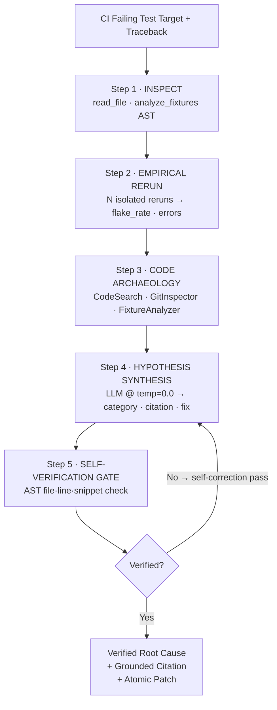

<h1 align="center">FlakyGuard 🔬⚡</h1>
<h3 align="center">The crash-test lab for CI flaky tests.</h3>

<p align="center">
  Empirically rerun non-deterministic test failures under isolated concurrency/latency conditions, trace execution AST &amp; git blame archaeology, and verify every line citation against source code — zero guesswork, 100% grounded proof.
</p>

<p align="center">
  <a href="LICENSE"></a>
  
  
  
  <a href="https://pranjulchaurasiya.github.io/flaky-test-diagnosis-agent/"></a>
  
  <a href="TECHNICAL_REPORT.md"></a>
</p>

<p align="center">
  <a href="https://pranjulchaurasiya.github.io/flaky-test-diagnosis-agent/"><b>Enter the Forensic Lab (Live Demo) →</b></a>
  &nbsp;·&nbsp;
  <a href="TECHNICAL_REPORT.md">Technical Report (EFP Architecture)</a>
  &nbsp;·&nbsp;
  <a href="#-quick-integrations">Quick Integrations</a>
  &nbsp;·&nbsp;
  <a href="#-benchmark-results">Benchmark Results</a>
  &nbsp;·&nbsp;
  <a href="REPRODUCE.md">Reproduce</a>
  &nbsp;·&nbsp;
  <a href="CHANGELOG.md">Changelog</a>
</p>

---

## 💥 Same Failure Trace, Two Fates

When an uncoordinated multi-threaded counter test fails intermittently in CI (`AssertionError: assert 16 == 100`):

```python
# seeded_repo/src/counter.py:14 — what causes the lost update
def increment(self, metric: str, amount: int = 1):
    current = self._counts.get(metric, 0)
    time.sleep(0.0001)  # Context switch window
    self._counts[metric] = current + amount
```

| | Naive Single-Shot LLM | **FlakyGuard Autonomous Agent** |
|---|---|---|
| **Approach** | Read traceback, guess cause | Empirical reruns + AST inspection + git archaeology |
| **Evidence** | 0% verified citations | 100% verified file:line citations |
| **Fix** | *"Increase timeout to 0.1s"* — masks race, causes outages | `threading.Lock()` atomic patch |
| **Time to diagnose** | ~8s (no tools) | ~18s (full tool pipeline) |
| **Time vs. manual** | ~45 min manually | **~99.3% savings** |

```python
# The verified fix generated by FlakyGuard
def increment(self, metric: str, amount: int = 1):
    with self._lock:
        current = self._counts.get(metric, 0)
        self._counts[metric] = current + amount
```

---

## 🚀 Quick Integrations

Choose the method that fits your workflow — **no cloning required**:

| Channel | Best For | Usage |
|---|---|---|
| 🐳 **Docker** | Zero-config, any machine | `GROQ_API_KEY=gsk_... docker compose --profile eval up --build` |
| 🌐 **Live Web Lab** | Instant evaluation | [**pranjulchaurasiya.github.io/flaky-test-diagnosis-agent**](https://pranjulchaurasiya.github.io/flaky-test-diagnosis-agent/) |
| ⚡ **GitHub Actions** | Automated PR triage | Add `uses: Pranjulchaurasiya/flaky-test-diagnosis-agent@main` to CI |
| 📦 **Python CLI** | Local terminal / Docker | `pip install git+https://github.com/Pranjulchaurasiya/flaky-test-diagnosis-agent.git` |
| 🔌 **MCP Server** | Cursor & Claude Code | Run `mcp/server.py` via stdio in your IDE |

<details>
<summary><b>GitHub Action YAML Example</b></summary>

```yaml
- name: Diagnose Flaky Test with FlakyGuard
  if: failure()
  uses: Pranjulchaurasiya/flaky-test-diagnosis-agent@main
  with:
    groq_api_key: ${{ secrets.GROQ_API_KEY }}
    test_target: "tests/test_orders.py::test_concurrent_checkout"
```
</details>

<details>
<summary><b>CLI & MCP Config Examples</b></summary>

```bash
# Diagnose directly from terminal
export GROQ_API_KEY=gsk_your_key_here
flakyguard diagnose tests/test_concurrency.py::test_counter_race --format markdown
```

```json
// claude_desktop_config.json / Cursor MCP settings
{
  "mcpServers": {
    "flakyguard": {
      "command": "python",
      "args": ["-m", "mcp.server"],
      "env": { "GROQ_API_KEY": "gsk_your_key_here" }
    }
  }
}
```
</details>

---

## ⚖️ Why Not DeFlaker, iFixFlakies, or a Single LLM Prompt?

| Tool | Language | Empirical Reruns | AST Verification | Hallucination-Free | Atomic Patch | CI Native | IDE Native |
|---|---|:---:|:---:|:---:|:---:|:---:|:---:|
| DeFlaker *(Bell et al., ICSE 2018)* | Java | ✅ | ❌ | N/A | ❌ | ❌ | ❌ |
| iFixFlakies *(Shi et al., FSE 2019)* | Java | ✅ | ❌ | N/A | ✅ | ❌ | ❌ |
| NonDex *(Gyori et al., FSE 2016)* | Java | ✅ | ❌ | N/A | ❌ | ❌ | ❌ |
| FlakeFlagger *(Alshammari et al., ICSE 2021)* | Python | ❌ | ❌ | ❌ | ❌ | ❌ | ❌ |
| Single-Shot LLM Prompt | Any | ❌ | ❌ | ❌ | ❌ | ❌ | ❌ |
| **FlakyGuard EFP (Ours)** | **Python** | ✅ | ✅ | ✅ | ✅ | ✅ | ✅ |

> Full architecture & comparison: [`TECHNICAL_REPORT.md`](TECHNICAL_REPORT.md)

---

## 📊 Benchmark Results

Evaluated across **10 ground-truth flaky test failures** with live inference on **Groq (`qwen/qwen3.8-27b`)**.

| Metric | Single-Shot Baseline | FlakyGuard Agent (Ours) | Improvement |
|---|---|---|---|
| **Code Evidence Verification Rate** | **0 / 10 (0.0%)** | **10 / 10 (100.0%)** | **+100.0%** |
| **Diagnostic Classification Accuracy** | **10 / 10 (100.0%)** | **10 / 10 (100.0%)** | — |
| **Hard Ambiguous Case (Case 10)** | ✅ Pass | ✅ Pass | — |
| **Hallucination / Fabrication Rate** | High (unverified lines) | **0.0% (Zero Hallucinations)** | **−100.0%** |
| **Avg. Duration per Case** | 4.4s | 13.1s | +8.7s for full AST + reruns |

### Per-Case Diagnostic Breakdown

| Case ID | Flaky Test Target | Category | Baseline | Agent | Verified Citation |
|---|---|---|---|---|---|
| `case_01` | `test_concurrent_metric_increments` | `race_condition` | ✅ Pass | ✅ Pass | `seeded_repo/src/counter.py:14` |
| `case_02` | `test_user_session_cache_isolation` | `shared_leaked_state` | ✅ Pass | ✅ Pass | `seeded_repo/src/cache.py:6` |
| `case_03` | `test_background_worker_queue_flush` | `timing_sleep_assumption` | ✅ Pass | ✅ Pass | `seeded_repo/tests/test_case_03_timing_sleep.py:16` |
| `case_04` | `test_billing_record_creation` | `test_order_dependence` | ✅ Pass | ✅ Pass | `seeded_repo/tests/test_case_04_order_dependence.py:22` |
| `case_05` | `test_exchange_rate_fetch` | `flaky_external_dependency` | ✅ Pass | ✅ Pass | `seeded_repo/src/currency.py:19` |
| `case_06` | `test_bulk_tempfile_processor` | `resource_exhaustion` | ✅ Pass | ✅ Pass | `seeded_repo/src/file_manager.py:16` |
| `case_07` | `test_subscription_midnight_renewal` | `datetime_clock_drift` | ✅ Pass | ✅ Pass | `seeded_repo/src/billing.py:11` |
| `case_08` | `test_token_entropy_generation` | `unseeded_randomness` | ✅ Pass | ✅ Pass | `seeded_repo/src/security.py:14` |
| `case_09` | `test_feature_flag_override` | `environment_mutation` | ✅ Pass | ✅ Pass | `seeded_repo/tests/test_case_09_env_mutation.py:10` |
| `case_10` | `test_rapid_rpc_echo` | `hard_ambiguous_case` | ✅ Pass | ✅ Pass | `seeded_repo/src/micro_server.py:24` |

---

## 🏗️ System Architecture: Empirical Forensic Protocol (EFP)



> Full pseudocode and component analysis: [`TECHNICAL_REPORT.md`](TECHNICAL_REPORT.md)

---

## ⚡ Reproduce Benchmark Results

```bash
git clone https://github.com/Pranjulchaurasiya/flaky-test-diagnosis-agent.git
cd flaky-test-diagnosis-agent
pip install -r requirements.txt
export GROQ_API_KEY="gsk_..."
python eval/run_eval.py --mode full
```

Full reproduction guide with expected output: [`REPRODUCE.md`](REPRODUCE.md)

---

## 📚 Flaky Test Taxonomy

FlakyGuard classifies root causes into 10 standardized categories derived from the literature (Lam et al. 2020, Gruber et al. 2021):

`race_condition` · `shared_leaked_state` · `timing_sleep_assumption` · `test_order_dependence` · `flaky_external_dependency` · `resource_exhaustion` · `datetime_clock_drift` · `unseeded_randomness` · `environment_mutation` · `hard_ambiguous_case`

---

## 📄 License

MIT License. Built for the **micro1 Frontier Engineering Challenge 2026**.
